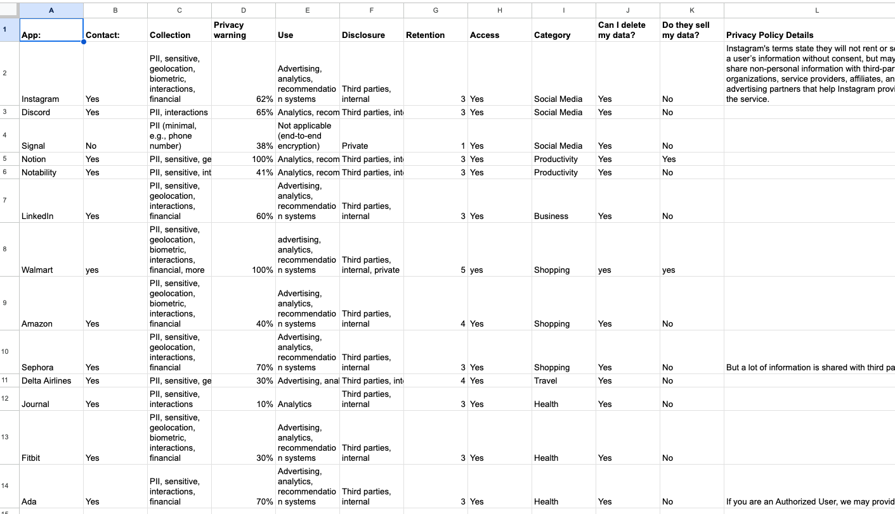
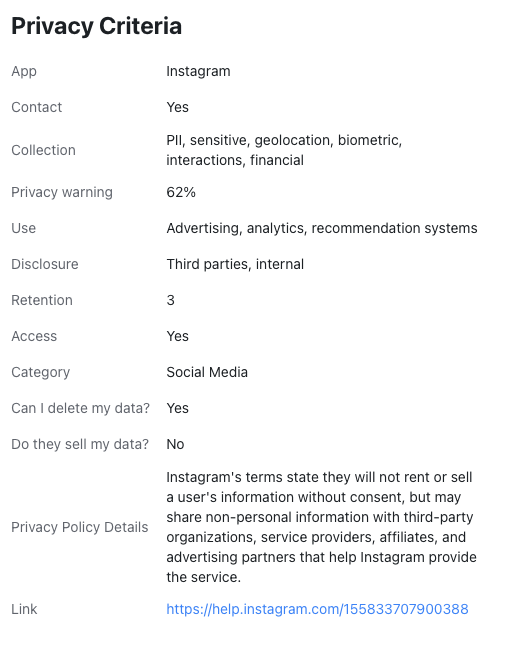
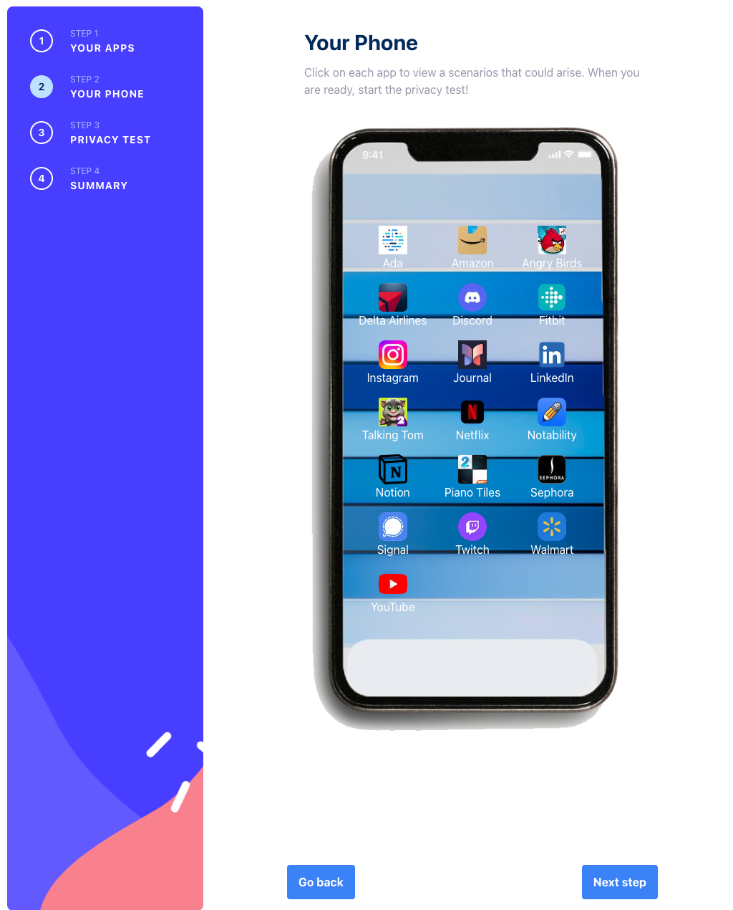
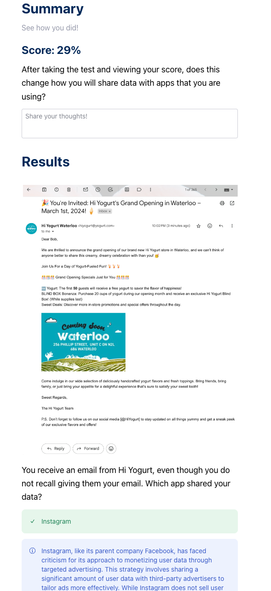

# CS 492 Privacy Quest

This is Freya Zhang and Zhehai Zhang's CS 492 Project. Hosted on a [website](https://cs492.zhehaizhang.com).

PrivacyQuest is an interactive game designed to enhance digital literacy and privacy awareness among users. The game begins in a simulated environment as the player receives a new smartphone loaded with various apps. Through interactive gameplay, realistic scenarios and a quiz, users embark on an educational journey, discovering the often overlooked aspects of app privacy policies and their implications on personal data. 

* **Phone Experience**: Players receive a phone with apps in each category, simulating real-world usage.
* **App Exploration**: Users explore each app's features, gaining insights into their activities and the associated privacy policy criteria we designed.
* **Educational Quiz**: Through a quiz at the end, players identify which apps might misuse (share, sell, or leak) their data based on real-life scenarios, enhancing their understanding and critical thinking regarding digital privacy.

At the end of their game, users will receive their Privacy-Awareness Score. We also collected anonymized data through PrivacyQuest gameplay results which are stored in a firebase app.

## Data Collection (`data-collection/*`)
In this folder, we have code that helped us collect data for our privacy criteria. This involves scraping 
Google Play for app details and also their privacy polices. After collecting the top 60 apps, we defined a privacy criteria.
The privacy criteria for the apps can be found at `data-collection/data.xlsx` and `data-collection/data-general.xlsx`.

Here is a preview of the privacy criteria data:


Here is how the privacy criteria looks like for an app:


## Game and Website (`multi-step-form/*`)
This folder contains the React code for the game.

How your phone looks like:


How an app scenario looks like:


How the quiz looks like:



## Setup

Make sure to install nvmrc. This means going to 
https://github.com/nvm-sh/nvm?tab=readme-ov-file#install--update-script

Make sure to refresh your terminal.

After setup, call `nvm use`. If this doesn't work you need to call nvm install.

```bash
cd multi-step-form
npm install
npm run dev
```